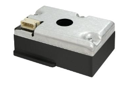

# Arduino-PM1006

Note : This Arduino library is a modified version of the original produced by Kevin Lutzer.

You can find his original source [here](https://github.com/kevinlutzer/Arduino-PM1006K).

An Arduino driver library to communicate with the Cubic PM1006 particulate matter sensor. This sensor can be found in the relatively inexpensive air quality monitor from Ikea [Vindriktning](https://www.ikea.com/ca/en/p/vindriktning-air-quality-sensor-60515911/).

You can find the data sheet for this sensor [here](https://cdn-learn.adafruit.com/assets/assets/000/122/217/original/PM1006_LED_PARTICLE_SENSOR_MODULE_SPECIFICATIONS-1.pdf?1688148991).

The PM1006 uses infrared LEDs and an infrared detector to measure the particulate concentrations of 2.5um particles in ug/m3. The sensor is designed to be used in conjunction with a fan to draw air down through the top of the sensor. 

A copy of the serial data exchange is given below.

